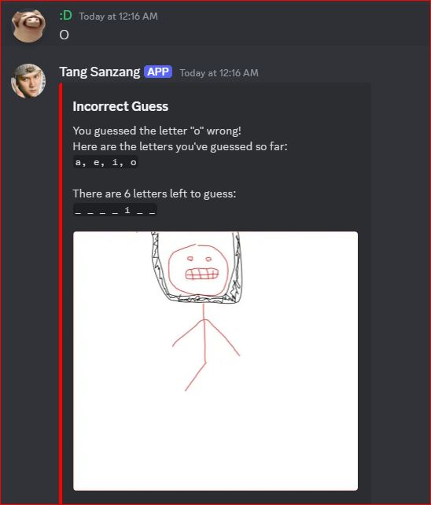
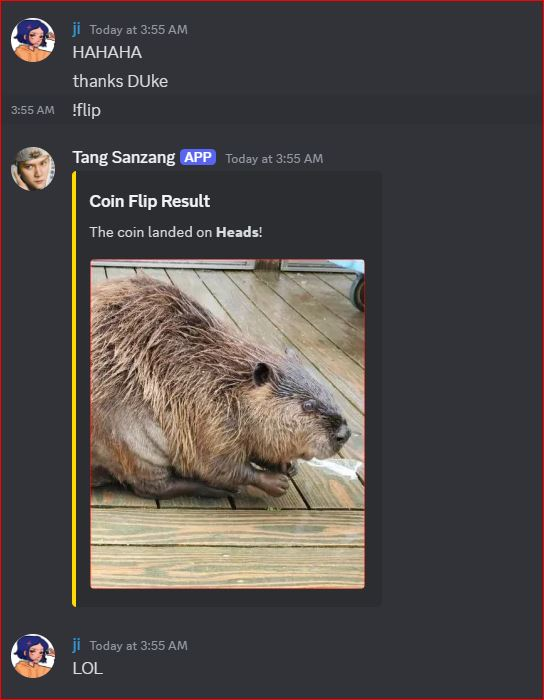
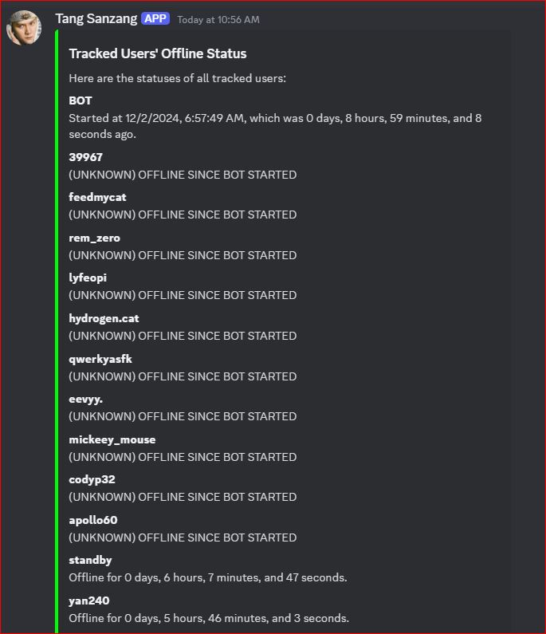

# Welcome to Tang Sanzhang Discord Bot! 🎉

Hey there! 👋 Ready to have some fun and make your server even more awesome? Check out the exciting features that Tang Sanzhang has to offer! 😎✨

### **✨ Available Commands**

- **/sleep [username]**  
  Ever wondered how long you've been asleep or how long it's been since you logged on? This command will show you exactly that! 🛌💤  
  Use "all" instead of a specific username to track the status for everyone.

- **/arena @username1 @username2 ...**  
  Roll the dice and battle it out with your friends in a voice call! Who will be victorious? 🎲🏆  
  Losers get kicked from the voice call. 😱

- **/flip**  
  Feeling lucky? Flip a coin and see if you land heads or tails! 🍀

- **/hangman**  
  Love word games? Play the classic game of Hangman with your friends and try to guess the word before the man gets hanged! 🎮🔤

- **/joinvc**  
  Want the bot to join your voice channel? Just use this command and let's get the party started! 🎧🎶

- **/attack @username**  
  Send a fun, friendly attack (aka an image) to another user to spread some joy! 💥🖼️  
  But there's less than a 1% chance for something unexpected to happen... 😱✨

- **/timer**  
  Set a timer for any task you need! ⏲️





---

## **Requirements**

Before getting started, make sure you have everything you need to run **Tang Sanzhang Bot**:

1. **Node.js** (version 16.x or higher)
2. **Npm** (Node Package Manager)
3. **Discord Bot Token**:  
   You'll need to create a bot on Discord's Developer Portal to obtain your bot token. Follow the [official guide](https://discord.com/developers/docs/intro) to set it up.
4. **.env File**:  
   For security, store sensitive information (like your bot token and server ID) in a `.env` file located in the root directory of your project.

---

## **Installation Guide**

Follow these simple steps to get **Tang Sanzhang Bot** up and running on your server:

1. **Invite the bot** to your server using the private invite link.
2. **Clone the repository** to your local machine:

    ```bash
    git clone https://github.com/DChau38/duke-bot.git
    ```

3. **Install required packages**:

    ```bash
    npm install
    ```

4. **Start the bot**:

    ```bash
    npm run start
    ```

   The bot will authenticate with Discord's servers and begin listening for events.

---

## **License**

This project is licensed under the **GNU General Public License (GPL)**.  
For full details, refer to the `GNU GPL License.txt` file in the repository.

You can learn more about the GNU GPL license by visiting the [official website](https://www.gnu.org/licenses/).

---

## **Contributing**

We'd love for you to contribute to **Tang Sanzhang Bot**! Whether you're fixing bugs, adding new features, or improving documentation, your contributions will help make the bot better for everyone. 😊

### How to Contribute:

1. **Fork the repository**:  
   Click the "Fork" button at the top right of the repository page to create your own copy of the project.

2. **Clone your fork**:  
   Clone your forked repository to your local machine:

    ```bash
    git clone https://github.com/DChau38/duke-bot.git
    ```

3. **Create a branch**:  
   Create a new branch for your feature or bug fix:

    ```bash
    git checkout -b feature-name
    ```

4. **Make your changes**:  
   Make your changes in the code, documentation, or tests.

5. **Stage your changes**:  
   Add your changes to the staging area:

    ```bash
    git add .
    ```

6. **Commit your changes**:  
   Commit your changes with a meaningful message:

    ```bash
    git commit -m "Add feature or fix bug"
    ```

7. **Push your changes**:  
   Push your branch to your fork:

    ```bash
    git push origin feature-name
    ```

8. **Create a pull request**:  
   Open a pull request to the main repository, describing the changes you made and why.

---

*Created by Duke 😁*

For any support or questions, feel free to ask — I'm always here to help!

Thank you for helping improve **Tang Sanzhang Bot**! 🎉
